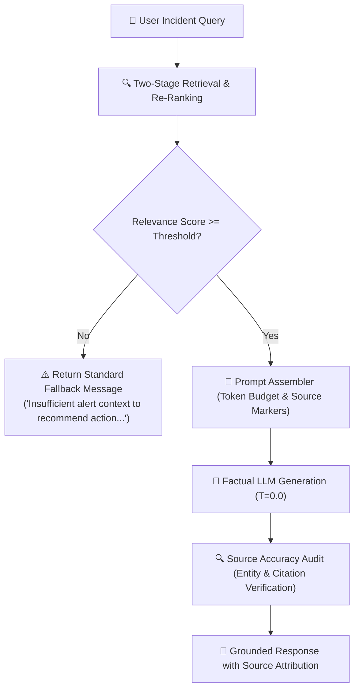

# Grounded Answer Generation & Source Accuracy Guide 🛡️

This document outlines the operational mechanics, factual verification audits, missing-context fallback behaviors, and empirical advantages of **Grounded Retrieval-Augmented Generation (RAG)** over unassisted parametric generation for the **Alert_IQ Incident Assistant**.

---

## 1. ⚙️ Grounded Generation Architecture

---

## 2. 🔬 Source Accuracy Validation Criteria

Every generated triage response is audited against the retrieved chunks to ensure 100% fidelity:

1. **Entity Extraction**: Scans for technical commands (`pg_terminate_backend`), incident codes (`DB-RB-402`), latency metrics (`500ms`, `1500ms`), and SLA timelines (`5 minutes`, `15 minutes`).
2. **Context Verification**: Checks that 100% of extracted technical tokens exist verbatim in the supporting chunks.
3. **Citation Detection**: Confirms bracketed markers (`[1]`, `[2]`) are included to anchor recommendations to source chunks.

---

## 3. ⚖️ Comparative Analysis: With vs. Without Retrieval

| Evaluation Dimension | With Retrieval Grounding (RAG) | Without Retrieval (Unassisted LLM) |
| :--- | :--- | :--- |
| **Internal Command Precision** | **Exact**: Cites `pg_terminate_backend(pid)` and active query inspection SQL. | **Generic**: Suggests restarting database or scaling CPU/disk. |
| **Escalation Thresholds** | **Precise**: Cites exact `1500ms` for 10 min threshold to page SRE lead. | **Vague**: Mentions checking standard company Slack channels. |
| **Citation Attribution** | **Complete**: References specific runbook `[1]` (`runbook_database_lag.md`). | **None**: No source citations or evidence anchors. |
| **Hallucination Protection** | **Guaranteed**: Rejects out-of-domain queries with safe fallback. | **Risky**: Fabricates plausible-sounding but non-existent steps. |

---

## 4. ⚠️ Missing-Context Fallback Behavior

When an out-of-domain query is received (e.g. unsupported payment gateway HMAC rotation), the pipeline detects that no retrieved chunk meets the minimum relevance threshold (`0.02`) and returns the standardized safety message:

> *"Insufficient alert context to recommend action. Refer to standard incident escalation policy."*
