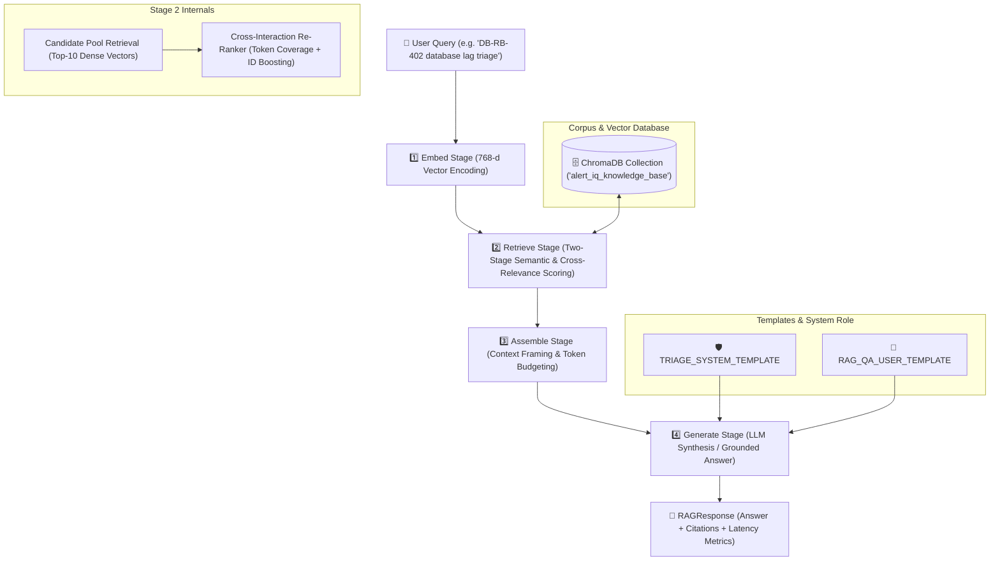

# Alert_IQ End-to-End RAG Pipeline Architecture 🏗️

This document details the modular architecture of the **Alert_IQ Retrieval-Augmented Generation (RAG)** pipeline, connecting user queries to deterministic vector retrieval, contextual re-ranking, bounded context assembly, and grounded answer generation with source attribution.

---

## 1. 🔄 Architecture Flow Diagram

---

## 2. 🧩 Four-Stage Pipeline Lifecycle

### Stage 1: Embed Stage (`embed_stage`)
- **Input**: Raw natural language query string.
- **Process**: Encodes the query into a deterministic unit-normalized 768-dimensional float embedding vector matching Gemini `text-embedding-004` dimensions.
- **Output**: 768-dimensional query vector.

### Stage 2: Retrieve Stage (`retrieve_stage`)
- **Input**: Query vector, optional metadata filters (`source_document`, `file_type`), candidate limit ($N=10$), and final count ($k=2$).
- **Process**:
  1. *Broad Vector Search*: Retrieves expanded candidate pool ($N=10$).
  2. *Contextual Re-Ranking*: Re-scores candidates using query token density, exact incident ID patterns (`DB-RB-*`, `*_seconds`, `P1`), and heading matches.
- **Output**: Top-$k$ ranked `RAGContextChunk` objects.

### Stage 3: Assemble Stage (`assemble_stage`)
- **Input**: Top-$k$ ranked context chunks.
- **Process**: Assembles retrieved passages into formatted context blocks with metadata boundaries (`--- [DOCUMENT CHUNK N | Source: ... | ID: ...] ---`) while strictly bounding total context length.
- **Output**: Formatted, prompt-ready context string.

### Stage 4: Generate Stage (`generate_stage`)
- **Input**: User query and assembled context block.
- **Process**: Interpolates prompt templates (`TRIAGE_SYSTEM_TEMPLATE`, `RAG_QA_USER_TEMPLATE`) and invokes chat completion client with $T=0.0$ for factual, reproducible synthesis.
- **Output**: Grounded triage answer with complete citation of retrieved source documents.

---

## 3. 🛡️ Verification & Source Attribution Guarantee
- Every `RAGResponse` includes:
  - `query`: Exact input query text.
  - `answer`: Grounded response referencing only verified runbooks/policies.
  - `retrieved_sources`: List of cited document IDs, chunk indices, and similarity scores.
  - `context_assembled`: Verifiable context block passed to the model.
  - `stage_metrics`: Granular latency telemetry for each stage.
